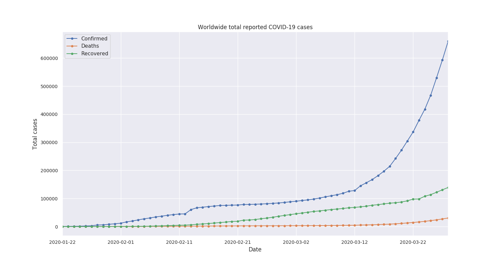

# Novel Coronavirus (COVID-19) datasets and analysis

This repository is an attempt to gather data on COVID-19 from various sources. The goal is to boost reseach on the impact of the virus. 


## Data sources

Data are updated daily - Last Update: 24/3/2020 13:53 GMT+0200

- Johns Hopkins CSSE: https://systems.jhu.edu/research/public-health/ncov
  - Data repository: https://github.com/CSSEGISandData/COVID-19

- European Centre for Disease Prevention and Control (ECDC): https://www.ecdc.europa.eu/en/coronavirus
  - Processed by Our World in Data: https://ourworldindata.org/coronavirus-source-data
  
- World Health Organization (WHO): https://www.who.int/emergencies/diseases/novel-coronavirus-2019
  - Processed by Our World in Data (**until 17/3/2020**): https://ourworldindata.org/coronavirus-source-data

## Data processing outputs

- [`output_data/covid19_clean_complete.csv`](https://github.com/AlexDelitzas/covid19-data/blob/master/output_data/covid19_clean_complete.csv): A cleaned and compact version of the data provided by Johns Hopkins CSSE. It provides information about coronavirus cases for every country.

- [`output_data/timeseries_per_country.json`](https://github.com/AlexDelitzas/covid19-data/blob/master/output_data/timeseries_per_country.json): The number of confirmed cases, recovered cases and deaths for every country since 22/1/2020.

  Available at: https://alexdelitzas.github.io/covid19-data/timeseries_per_country.json
  ```
  {
    "China": [
      {
        "date": "2020-01-22",
        "confirmed": 548,
        "recovered": 28,
        "deaths": 17
      },
      {
        "date": "2020-01-23",
        "confirmed": 643,
        "recovered": 30,
        "deaths": 18
      },
      {
        "date": "2020-01-24",
        "confirmed": 920,
        "recovered": 36,
        "deaths": 26
      },
      ...
    ],
    ...
  }   
  ```

## Data visualizations

**Total reported cases (worldwide):**


## How to contribute
We are looking for volunteers who want to contribute! We are also looking for fresh ideas to expand our project's goal!

Contact Us: 
- e-mail: 
  - alex.delitzas@gmail.com
  - billmats96@hotmail.com
  - kechrisc@gmail.com
